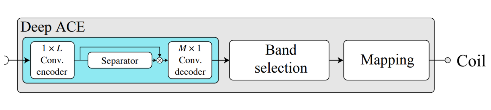

# DeepACE

Cochlear implant (CI) users struggle to understand speech in noisyconditions.   In  this  work,  we  propose  an  end-to-end  speech  cod-ing  and  denoising  sound  coding  strategy  that  estimates  the  elec-trodograms  from  the  raw  audio  captured  by  the  microphone.   Wecompared this approach to a classic Wiener filter and TasNet to as-sess  its  potential  benefits  in  the  context  of  electric  hearing.   Theperformance of the network is assessed by means of noise reduc-tion performance (signal-to-noise-ratio improvement) and objectivespeech intelligibility measures.   Furthermore,  speech intelligibilitywas measured in 5 CI users to assess the potential benefits of eachof the investigated algorithms.  Results suggest that the speech per-formance of the tested group seemed to be equally good using ourmethod compared to the front-end speech enhancement algorithm.

